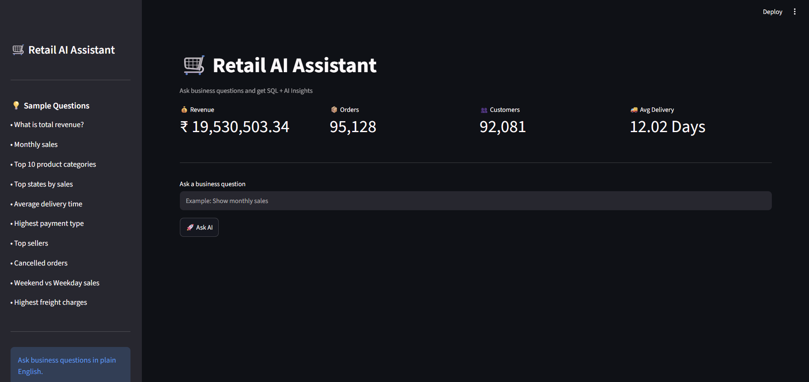
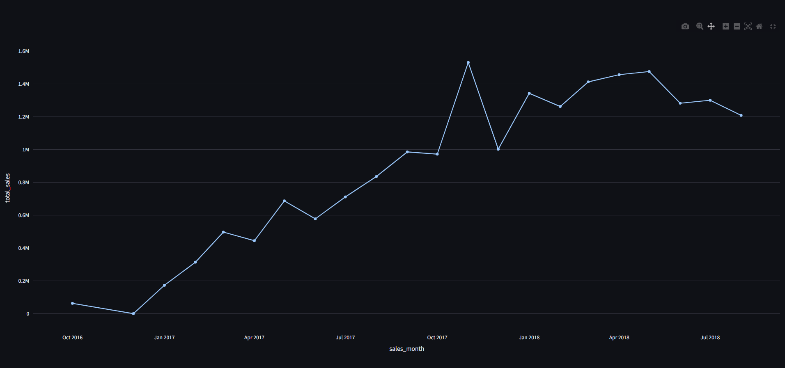
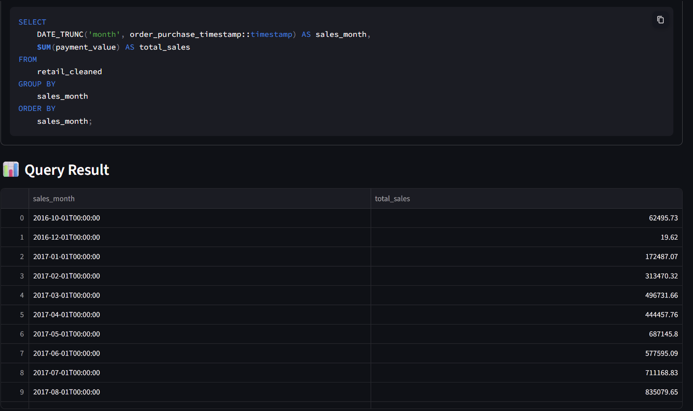
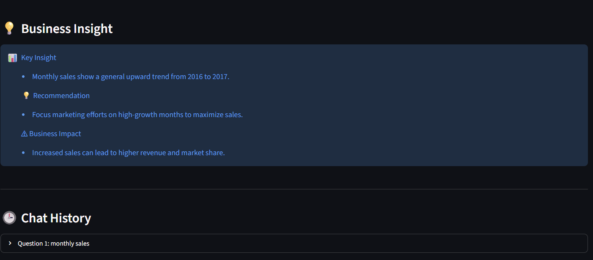
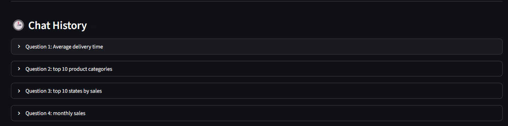

# 🛒 Retail AI Assistant

## Overview

Retail AI Assistant is an AI-powered analytics application that converts natural language business questions into SQL queries, executes them on a PostgreSQL database, and provides interactive visualizations with AI-generated business insights.

---

## Features

- 🤖 Natural Language to SQL
- 🗄 PostgreSQL Database Integration
- ⚡ FastAPI Backend
- 📊 Interactive Dashboard
- 📈 Automatic Data Visualization
- 💡 AI Business Insights
- 🎯 Business Recommendations
- 📥 Download Results as CSV
- 🕒 Chat History
- ⏱ Query Execution Time

---

## Tech Stack

- Python
- FastAPI
- PostgreSQL
- Streamlit
- Plotly
- Groq Llama 3
- Pandas
- Psycopg2

---

## Project Workflow

This project follows an end-to-end retail analytics workflow:

1. Data cleaning and preprocessing using Python (Pandas).
2. Business analysis using PostgreSQL and SQL.
3. Interactive dashboard development in Power BI.
4. AI-powered Retail Assistant using FastAPI, Streamlit, and Groq LLM for natural language querying.

## Project Structure

```
Retail_AI_Assistant/
│
├── app.py
├── ai.py
├── database.py
├── sql_agent.py
├── streamlit_app.py
├── config.py
├── requirements.txt
├── README.md
├── .gitignore
└── pages/
```

---

## Sample Questions

- Show monthly sales
- Top 10 states by revenue
- Highest payment type
- Weekend vs weekday sales
- Average delivery days
- Top selling categories

---

## Screenshots

(## Screenshots

### Home



---

### Dashboard



---

### AI Assistant



---

### Business Insight



### Chat History


---

## Future Improvements

- PDF report export
- Authentication
- Cloud deployment
- Advanced visual analytics

---

## Author

**Tirupati Chandrasekhar**

B.Tech CSE (Data Science)
